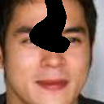
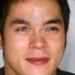

# Image inpainting based on GAN

## Abstract

- This repository is about an inpainting algorithm based on GAN implemented in pytorch.
- Training and inpainting scripts are provided in this repository.
- You may transform the basic codes into your own applications.
- If you think the codes are valuable, please do not hesitate to **highlight the star**, thank you.

1. ## Quick start

    - You can use my [pre-trained model](https://pan.baidu.com/s/1lB6cZwNeoFyNyv--tOe5zg) (Extracting Code: **suaf**) of face data to inpaint the demo images, and put it into the *./output/face/DCGAN*.

      ~~~shell
      sh test.sh
      ~~~

    - Find the results in *./output/face/DCGAN/results_of_demo/inpainted_images*

2. ## Train your own dataset

   - Build your own dataset, and put the images in $dataroot/**face**.

   - $dataroot is the parameter of root in **dset.ImageFolder()**.

   - Modify the *train.sh*.

     ~~~shell
     sh train.sh
     ~~~

   - When the training of GANs is done, you can inpaint the occluded images using the trained model just like the **Quick start** in section 1.

3. ## Some illustrations

   | Algorithms |    Ground truth     | Occluded image           | Inpainted result    |
   | :--------: | :-----------------: | ------------------------ | ------------------- |
   |   DCGAN    |  |  |  |

   
